# ClaudeKit Marketing — Commands & Skills Catalog

> **Stable:** v1.2.1 · **Beta:** v1.3.0-beta.8 · **Updated:** 2026-03-12

Marketing Kit sử dụng **2 hệ thống plugin** song song: **Commands** (`.claude/commands/mkt/`) và **Skills** (`.claude/skills/`). Cả hai đều hoạt động qua slash commands trong Claude Code.

- **Commands**: Lightweight slash commands (`.md` files), hỗ trợ subcommands qua directories. Invoked trực tiếp bằng `/mkt:<name>`.
- **Skills**: Full plugin format (`SKILL.md` + `references/` + `scripts/`), auto-discovered bởi Claude Code. Dùng namespace `ck:` (shared) hoặc `ckm:` (marketing-exclusive).

---

## Namespace Convention

| Prefix | Meaning | Stable Count | Beta Count | Example |
|--------|---------|-------------|------------|---------|
| `ck:` | Shared with Engineer Kit | ~41 skills | ~48 skills | `ck:cook`, `ck:git`, `ck:brainstorm` |
| `ckm:` | Marketing Kit exclusive | ~37 skills | ~48 skills | `ckm:seo-optimization`, `ckm:campaign-management` |
| `mkt:` | Commands namespace | 29 commands | 29 commands | `/mkt:campaign`, `/mkt:write`, `/mkt:seo` |

### Dual-Install Mode (Engineer Kit + Marketing Kit cùng 1 project)

Khi install cả 2 Kit vào cùng 1 project, `ck:` skills **được chia sẻ chung** — chỉ cần 1 bản duy nhất, không bị duplicate. Marketing Kit tự detect và reuse các `ck:` skills đã có từ Engineer Kit.

**Lợi ích:**
- **Không trùng lặp:** `ck:` skills chỉ load 1 lần, tiết kiệm context
- **Nhất quán:** `/cook`, `/git`, `/plan`, `/fix` hoạt động giống nhau bất kể gọi từ workflow nào
- **Mở rộng tự nhiên:** Marketing Kit thêm `ckm:` skills chuyên biệt bên cạnh shared core

**Lưu ý khi dual-install:**
- Nếu 2 Kit có version khác nhau của cùng 1 `ck:` skill, version mới hơn sẽ được ưu tiên
- `ckm:` skills có thể gọi `ck:` skills nội bộ (vd: `ckm:write` dùng `ck:copywriting`, `ckm:seo` dùng `ck:scout`)
- Agent definitions cũng chia sẻ: 11 shared agents (`code-reviewer`, `debugger`, `planner`...) dùng chung

---

## Complexity Legend

Token estimates based on SKILL.md file size (~4 chars/token). Higher complexity = more context consumed per invocation.

| Symbol | Level | Tokens | Context Impact |
|--------|-------|--------|----------------|
| ⚡ | Minimal | <1K | Always safe, negligible context cost |
| ⚡⚡ | Low | 1K–3K | Lightweight, can stack many |
| ⚡⚡⚡ | Medium | 3K–5K | Standard load, 2-3 simultaneous OK |
| ⚡⚡⚡⚡ | High | 5K–10K | Heavy load, use selectively |
| ⚡⚡⚡⚡⚡ | Very High | 10K+ | Significant context, avoid stacking |

---
## Độ Phức Tạp Commands

Bảng dưới liệt kê tất cả Stable commands (từ `commands-marketing-kit.ts`) theo thứ tự độ phức tạp tăng dần.

**Chú thích mức độ:** ⚡ Tối thiểu · ⚡⚡ Thấp · ⚡⚡⚡ Trung bình · ⚡⚡⚡⚡ Cao

### ⚡ Tối thiểu

| Command | Complexity | Category |
|---------|-----------|----------|
| `ck:brainstorm` | ⚡ | Essentials |
| `/mkt:ask` | ⚡ | Essentials |
| `/mkt:ck-help` | ⚡ | Essentials |
| `/mkt:campaign status` | ⚡ | Campaign |
| `/mkt:test` | ⚡ | Dev & Integration |
| `ck:git` | ⚡ | Dev & Integration |
| `/mkt:use-mcp` | ⚡ | Skills & Utilities |
| `/mkt:journal` | ⚡ | Skills & Utilities |
| `/mkt:kanban` | ⚡ | Skills & Utilities |
| `/mkt:watzup` | ⚡ | Skills & Utilities |
| `/mkt:preview` | ⚡ | Skills & Utilities |
| `/mkt:hub` | ⚡ | Skills & Utilities |
| `/mkt:storage` | ⚡ | Skills & Utilities |
| `ckm:assets-organizing` | ⚡ | Skills & Utilities |

### ⚡⚡ Thấp

| Command | Complexity | Category |
|---------|-----------|----------|
| `/mkt:init` | ⚡⚡ | Essentials |
| `/mkt:write fast` | ⚡⚡ | Content & Copy |
| `/mkt:write enhance` | ⚡⚡ | Content & Copy |
| `/mkt:write blog` | ⚡⚡ | Content & Copy |
| `/mkt:write audit` | ⚡⚡ | Content & Copy |
| `/mkt:write publish` | ⚡⚡ | Content & Copy |
| `ckm:creativity` | ⚡⚡ | Content & Copy |
| `ck:copywriting` | ⚡⚡ | Content & Copy |
| `/mkt:seo keywords` | ⚡⚡ | SEO & Analytics |
| `/mkt:analyze` | ⚡⚡ | SEO & Analytics |
| `ckm:analytics` | ⚡⚡ | SEO & Analytics |
| `ckm:banner-design` | ⚡⚡ | Design & Visual |
| `ckm:slides-design` | ⚡⚡ | Design & Visual |
| `/mkt:social schedule` | ⚡⚡ | Email & Social |
| `/mkt:plan fast` | ⚡⚡ | Strategy & Research |
| `/mkt:persona` | ⚡⚡ | Strategy & Research |
| `ckm:marketing-ideas` | ⚡⚡ | Strategy & Research |
| `/mkt:video script` | ⚡⚡ | Video & Media |
| `/mkt:youtube` | ⚡⚡ | Video & Media |
| `/mkt:youtube blog` | ⚡⚡ | Video & Media |
| `/mkt:slides` | ⚡⚡ | Video & Media |
| `ckm:form-cro` | ⚡⚡ | Growth & CRO |
| `/mkt:fix` | ⚡⚡ | Dev & Integration |
| `/mkt:debug` | ⚡⚡ | Dev & Integration |
| `/mkt:worktree` | ⚡⚡ | Dev & Integration |
| `/mkt:skill create` | ⚡⚡ | Skills & Utilities |
| `/mkt:dashboard` | ⚡⚡ | Skills & Utilities |
| `/mkt:brand` | ⚡⚡ | Skills & Utilities |
| `/mkt:docs` | ⚡⚡ | Skills & Utilities |
| `ckm:content-hub` | ⚡⚡ | Skills & Utilities |
| `ckm:kit-builder` | ⚡⚡ | Skills & Utilities |

### ⚡⚡⚡ Trung bình

| Command | Complexity | Category |
|---------|-----------|----------|
| `/mkt:plan` | ⚡⚡⚡ | Essentials |
| `/mkt:write good` | ⚡⚡⚡ | Essentials |
| `/mkt:write cro` | ⚡⚡⚡ | Content & Copy |
| `ckm:content-marketing` | ⚡⚡⚡ | Content & Copy |
| `/mkt:campaign create` | ⚡⚡⚡ | Campaign |
| `/mkt:campaign analyze` | ⚡⚡⚡ | Campaign |
| `/mkt:campaign email` | ⚡⚡⚡ | Campaign |
| `/mkt:seo audit` | ⚡⚡⚡ | SEO & Analytics |
| `/mkt:seo pseo` | ⚡⚡⚡ | SEO & Analytics |
| `ckm:ab-test-setup` | ⚡⚡⚡ | SEO & Analytics |
| `ckm:paid-ads` | ⚡⚡⚡ | SEO & Analytics |
| `ckm:logo-design` | ⚡⚡⚡ | Design & Visual |
| `ckm:cip-design` | ⚡⚡⚡ | Design & Visual |
| `ckm:design-system` | ⚡⚡⚡ | Design & Visual |
| `/mkt:email flow` | ⚡⚡⚡ | Email & Social |
| `/mkt:email sequence` | ⚡⚡⚡ | Email & Social |
| `ckm:email-marketing` | ⚡⚡⚡ | Email & Social |
| `ckm:social-media` | ⚡⚡⚡ | Email & Social |
| `/mkt:plan cro` | ⚡⚡⚡ | Strategy & Research |
| `/mkt:competitor` | ⚡⚡⚡ | Strategy & Research |
| `/mkt:funnel` | ⚡⚡⚡ | Strategy & Research |
| `ckm:marketing-planning` | ⚡⚡⚡ | Strategy & Research |
| `ckm:marketing-research` | ⚡⚡⚡ | Strategy & Research |
| `ckm:marketing-psychology` | ⚡⚡⚡ | Strategy & Research |
| `/mkt:video` | ⚡⚡⚡ | Video & Media |
| `/mkt:video create` | ⚡⚡⚡ | Video & Media |
| `ckm:pricing-strategy` | ⚡⚡⚡ | Growth & CRO |
| `ckm:free-tool-strategy` | ⚡⚡⚡ | Growth & CRO |
| `ckm:gamification-marketing` | ⚡⚡⚡ | Growth & CRO |
| `ckm:affiliate-marketing` | ⚡⚡⚡ | Growth & CRO |
| `ckm:referral-program-building` | ⚡⚡⚡ | Growth & CRO |
| `ckm:onboarding-cro` | ⚡⚡⚡ | Growth & CRO |
| `ck:code-review` | ⚡⚡⚡ | Dev & Integration |

### ⚡⚡⚡⚡ Cao

| Command | Complexity | Category |
|---------|-----------|----------|
| `/mkt:campaign` | ⚡⚡⚡⚡ | Campaign |
| `/mkt:plan hard` | ⚡⚡⚡⚡ | Strategy & Research |
| `ckm:ads-management` | ⚡⚡⚡⚡ | SEO & Analytics |
| `ckm:design` | ⚡⚡⚡⚡ | Design & Visual |
| `ckm:launch-strategy` | ⚡⚡⚡⚡ | Growth & CRO |

---

## Sơ Đồ Quyết Định Tương Tác

Dùng sơ đồ này để chọn command/skill phù hợp dựa trên mục tiêu.

```mermaid
flowchart TD
    START(["Ban muon lam gi?"]) --> A{"Chu de chinh"}

    A --> W["Viet noi dung"]
    A --> C["Chien dich"]
    A --> S["SEO va Ads"]
    A --> E["Email va Social"]
    A --> D["Thiet ke"]
    A --> V["Video"]
    A --> ST["Chien luoc"]
    A --> G["Tang truong va CRO"]
    A --> U["Tien ich"]

    W --> W1{"Loai noi dung?"}
    W1 --> CMD_WFAST["mkt:write fast"]
    W1 --> CMD_WGOOD["mkt:write good"]
    W1 --> CMD_WCRO["mkt:write cro"]
    W1 --> CMD_WBLOG["mkt:write blog"]
    W1 --> CMD_WAUDIT["mkt:write audit"]
    W1 --> CMD_WENH["mkt:write enhance"]
    W1 --> CMD_WPUB["mkt:write publish"]
    W1 --> SKL_CREAT["ck:copywriting\nckm:creativity"]

    C --> C1{"Giai doan?"}
    C1 --> CMD_CC["mkt:campaign create"]
    C1 --> CMD_CS["mkt:campaign status"]
    C1 --> CMD_CA["mkt:campaign analyze"]
    C1 --> CMD_CE["mkt:campaign email"]
    C1 --> SKL_CAMP["ckm:campaign-management"]

    S --> S1{"Muc tieu?"}
    S1 --> CMD_SKEY["mkt:seo keywords"]
    S1 --> CMD_SAUD["mkt:seo audit"]
    S1 --> CMD_SPEO["mkt:seo pseo"]
    S1 --> SKL_ADS["ckm:ads-management\nckm:paid-ads"]
    S1 --> CMD_ANL["mkt:analyze report"]
    S1 --> SKL_AB["ckm:ab-test-setup"]

    E --> E1{"Kenh?"}
    E1 --> CMD_EF["mkt:email flow"]
    E1 --> CMD_ES["mkt:email sequence"]
    E1 --> SKL_EM["ckm:email-marketing"]
    E1 --> CMD_SS["mkt:social schedule"]
    E1 --> SKL_SM["ckm:social-media"]

    D --> D1{"Loai thiet ke?"}
    D1 --> SKL_LOGO["ckm:logo-design"]
    D1 --> SKL_CIP["ckm:cip-design"]
    D1 --> SKL_DS["ckm:design-system"]
    D1 --> SKL_SLD["ckm:slides-design"]
    D1 --> SKL_DES["ckm:design"]

    V --> V1{"Nhu cau?"}
    V1 --> CMD_VC["mkt:video create"]
    V1 --> CMD_VS["mkt:video script"]
    V1 --> CMD_YTB["mkt:youtube blog"]
    V1 --> SKL_VP["ckm:video-production"]

    ST --> ST1{"Loai chien luoc?"}
    ST1 --> CMD_PLAN["mkt:plan\nfast / hard / cro"]
    ST1 --> SKL_MR["ckm:marketing-research"]
    ST1 --> CMD_COMP["mkt:competitor"]
    ST1 --> CMD_PER["mkt:persona"]
    ST1 --> CMD_FUN["mkt:funnel"]
    ST1 --> SKL_MI["ckm:marketing-ideas"]
    ST1 --> SKL_MP["ckm:marketing-psychology"]

    G --> G1{"Muc tieu tang truong?"}
    G1 --> SKL_LS["ckm:launch-strategy"]
    G1 --> SKL_PS["ckm:pricing-strategy"]
    G1 --> SKL_FC["ckm:form-cro"]
    G1 --> SKL_OC["ckm:onboarding-cro"]
    G1 --> SKL_AF["ckm:affiliate-marketing\nreferral-program-building"]
    G1 --> SKL_GM["ckm:gamification-marketing"]
    G1 --> SKL_FT["ckm:free-tool-strategy"]

    U --> U1{"Cong cu ho tro?"}
    U1 --> CMD_INIT["mkt:init"]
    U1 --> SKL_BS["ck:brainstorm"]
    U1 --> CMD_ASK["mkt:ask"]
    U1 --> CMD_HUB["mkt:hub\nmkt:dashboard"]
    U1 --> CMD_STR["mkt:storage"]
    U1 --> SKL_AO["ckm:assets-organizing"]
    U1 --> CMD_PRV["mkt:preview"]
    U1 --> SKL_GIT["ck:git\nmkt:worktree"]

    classDef cmd fill:#dbeafe,stroke:#3b82f6,color:#1e3a5f
    classDef skill fill:#dcfce7,stroke:#22c55e,color:#14532d
    classDef category fill:#f3e8ff,stroke:#a855f7,color:#4a044e

    class CMD_WFAST,CMD_WGOOD,CMD_WCRO,CMD_WBLOG,CMD_WAUDIT,CMD_WENH,CMD_WPUB cmd
    class CMD_CC,CMD_CS,CMD_CA,CMD_CE cmd
    class CMD_SKEY,CMD_SAUD,CMD_SPEO,CMD_ANL cmd
    class CMD_EF,CMD_ES,CMD_SS cmd
    class CMD_VC,CMD_VS,CMD_YTB cmd
    class CMD_PLAN,CMD_COMP,CMD_PER,CMD_FUN cmd
    class CMD_INIT,CMD_ASK,CMD_HUB,CMD_STR,CMD_PRV cmd
    class SKL_CREAT,SKL_CAMP,SKL_ADS,SKL_AB,SKL_EM,SKL_SM skill
    class SKL_LOGO,SKL_CIP,SKL_DS,SKL_SLD,SKL_DES skill
    class SKL_VP,SKL_MR,SKL_MI,SKL_MP skill
    class SKL_LS,SKL_PS,SKL_FC,SKL_OC,SKL_AF,SKL_GM,SKL_FT skill
    class SKL_BS,SKL_AO,SKL_GIT skill
    class W,C,S,E,D,V,ST,G,U category
```



> **Chú thích màu sắc:**
> - Nền xanh dương = `/mkt:` Commands (lightweight, invoke trực tiếp)
> - Nền xanh lá = Skills (`ck:` / `ckm:`, plugin đầy đủ với references & scripts)
> - Nền tím = Danh mục chính

---

## Commands (29 in Stable)

Commands live in `.claude/commands/mkt/`. Single-file (`.md`) commands handle simple tasks; directory-based commands support subcommands.

| Command | Subcommands | Description |
|---------|-------------|-------------|
| `/mkt:analyze` | `report` | Analytics and performance reports |
| `/mkt:ask` | — | Expert consultation (marketing context) |
| `/mkt:brand` | `update` | Brand guidelines management |
| `/mkt:campaign` | `create`, `status`, `analyze`, `email` | Campaign management |
| `/mkt:ck-help` | — | ClaudeKit usage guide |
| `/mkt:competitor` | — | Competitive analysis |
| `/mkt:dashboard` | `check` | Marketing Dashboard launcher |
| `/mkt:docs` | `init`, `llms`, `summarize`, `update` | Documentation management |
| `/mkt:email` | `flow`, `sequence` | Email marketing campaigns |
| `/mkt:funnel` | — | Funnel design and optimization |
| `/mkt:hub` | — | Content Hub + Dashboard combo |
| `/mkt:init` | — | Initialize marketing project |
| `/mkt:journal` | — | Write journal entries |
| `/mkt:kanban` | — | Agent orchestration board |
| `/mkt:persona` | — | Customer persona management |
| `/mkt:plan` | `archive`, `ci`, `cro`, `fast`, `hard`, `parallel`, `two`, `validate` | Plan creation |
| `/mkt:preview` | — | View files/visual explanations |
| `/mkt:seo` | `audit`, `keywords`, `pseo` | SEO optimization |
| `/mkt:skill` | `add`, `create`, `fix-logs`, `optimize`, `plan`, `update` | Skill management |
| `/mkt:slides` | `create` | Presentation creation |
| `/mkt:social` | `schedule` | Social media management |
| `/mkt:storage` | `list`, `sync`, `upload`, `url` | S3 storage operations |
| `/mkt:test` | `ui`, `workflow` | Run tests |
| `/mkt:use-mcp` | — | MCP tool discovery & execution |
| `/mkt:video` | `create`, `script`, `storyboard` | Video production |
| `/mkt:watzup` | — | Review recent changes |
| `/mkt:worktree` | — | Git worktree management |
| `/mkt:write` | `audit`, `blog`, `cro`, `enhance`, `fast`, `formula`, `good`, `publish` | Content writing (8 modes) |
| `/mkt:youtube` | `blog`, `infographic`, `social` | YouTube content repurposing |

---

## Skills (78 in Stable · 96 in Beta)

> Skills marked with 🆕 are new in Beta. Skills marked with 📝 were renamed from Stable.
> In Stable, skills use original names (e.g., `campaign-management`, `seo-optimization`). Beta renames shown with 📝.

### 🎯 Core Workflow Skills (Shared)

| Skill | Usage | Description |
|-------|-------|-------------|
| `ck:cook` | `/cook [task\|plan-path] [--interactive\|--fast\|--parallel\|--auto\|--no-test]` | All-in-one feature implementation: research → plan → implement → test → review |
| `ck:plan` | `/plan [archive\|ci\|cro\|fast\|hard\|parallel\|two\|validate] [task]` | Intelligent plan creation with prompt enhancement. Marketing adds `cro` mode |
| `fixing` | `/fix [issue] --auto\|--review\|--quick\|--parallel` | 📝 *Beta: `ck:fix`*. Smart bug fixing with routing to specialized fix commands |
| `Debugging` | `/debugging [error or issue description]` | 📝 *Beta: `ckm:debugging`*. Marketing-specific debugging with campaign/funnel context |
| `test-orchestrator` | `/test-orchestrator [ui\|workflow] [target]` | 📝 *Beta: `ck:test`*. Run tests. Marketing adds `workflow` for validating commands/agents/skills |
| `ck:code-review` | `/code-review [context] OR codebase [parallel]` | Review code quality with scout-based edge case detection |

### 📢 Marketing Strategy & Planning

| Skill | Usage | Description |
|-------|-------|-------------|
| `ckm:marketing-planning` | `/marketing-planning [goal or timeframe]` | Plan strategies using RACE, SOSTAC, STP frameworks. Activates marketing-research |
| `ckm:marketing-research` | `/marketing-research [topic or market]` | Research market trends, competitors, audience insights |
| `ckm:marketing-ideas` | `/marketing-ideas [product or niche]` | 140 proven marketing approaches organized by category |
| `ckm:marketing-psychology` | `/marketing-psychology [principle or tactic]` | 70+ mental models for marketing: cognitive biases, persuasion, consumer behavior |
| `ckm:launch-strategy` | `/launch-strategy [product or feature]` | Product launch, Product Hunt, go-to-market, beta launch, waitlist |
| `ckm:pricing-strategy` | `/pricing-strategy [product or tier]` | Pricing tiers, freemium, Van Westendorp, packaging strategy |
| `ckm:free-tool-strategy` | `/free-tool-strategy [tool-idea or niche]` | Engineering-as-marketing: build free tools for lead gen & SEO |
| `ckm:gamification-marketing` | `/gamification-marketing [mechanic or campaign]` | Points, badges, leaderboards, streaks for loyalty & engagement |
| 🆕 `ckm:init` | `/init [prompt]` | Initialize marketing project with full setup |

### 📊 Campaign & Analytics

| Skill | Usage | Description |
|-------|-------|-------------|
| `ckm:campaign-management` | `/campaign-management [action] [name]` | 📝 *Beta: `ckm:campaign`*. End-to-end campaign management |
| `ckm:analytics` | `/analytics [metric or report-type]` | KPI tracking, reporting dashboards, attribution, ROI analysis |
| 🆕 `ckm:analyze` | `/analyze [type]` | Analytics and performance reports (Beta only) |
| `ckm:ab-test-setup` | `/ab-test-setup [page or feature]` | Plan, design, implement A/B tests and experiments |
| `ckm:competitor-alternatives` | `/competitor-alternatives [url or competitor]` | 📝 *Beta: `ckm:competitor` with 5 subcommands*. Competitive analysis & battlecards |

### ✍️ Content Creation & Copywriting

| Skill | Usage | Description |
|-------|-------|-------------|
| 🆕 `ckm:write` | `/write [audit\|blog\|blog-youtube\|cro\|enhance\|fast\|good\|publish] [args]` | Creative copy, blog posts, CRO content. 8 subcommands |
| `ck:copywriting` | `/copywriting [copy-type] [context]` | Conversion formulas, headlines, email copy, landing pages, CTAs |
| `ckm:content-marketing` | `/content-marketing [content-type] [topic]` | Content strategy, editorial calendars, content pillar mapping |
| `ckm:creativity` | `/creativity [style or medium]` | 55 styles, 18 platforms, 12 voiceover types, 30 campaign categories |

### 📬 Email & Social

| Skill | Usage | Description |
|-------|-------|-------------|
| `ckm:email-marketing` | `/email-marketing [flow\|sequence] [args]` | 📝 *Beta: `ckm:email` with 6 subcommands*. Email campaigns, drip sequences, A/B testing |
| `ckm:social-media` | `/social-media [platform] [type]` | 📝 *Beta: `ckm:social`*. Multi-platform: X, Facebook, LinkedIn, TikTok, YouTube |

### 🔍 SEO & Ads

| Skill | Usage | Description |
|-------|-------|-------------|
| `ckm:seo-optimization` | `/seo-optimization [target]` | 📝 *Beta: `ckm:seo` with 5 subcommands*. Keyword research (ReviewWeb.site API), GSC API, pSEO, JSON+LD |
| `ckm:ads-management` | `/ads-management [platform] [campaign-type]` | Google Ads, Meta Ads, LinkedIn Ads, TikTok Ads. AI creative generation |
| `ckm:paid-ads` | `/paid-ads [platform] [campaign-type]` | PPC strategy, ad copy, ROAS optimization, retargeting |

### 🎨 Brand & Identity

| Skill | Usage | Description |
|-------|-------|-------------|
| `ckm:brand-guidelines` | `/brand-guidelines [args]` | 📝 *Beta: `ckm:brand` with subcommands*. Brand voice, visual identity, messaging, asset management |
| 🆕 `ckm:persona` | `/persona [action]` | Customer persona management (Beta only) |

### 🎬 Design & Visual

| Skill | Usage | Description |
|-------|-------|-------------|
| `ckm:design` | `/design [design-type] [context]` | Comprehensive: logo (55 styles), CIP (50 deliverables), banners, icons, social photos |
| `ckm:logo-design` | `/logo-design [brand-name] [style]` | 55 styles, 30 color palettes, 25 industries. Gemini Nano Banana AI |
| `ckm:cip-design` | `/cip-design [deliverable or brand-element]` | Corporate Identity Program: business cards, letterhead, signage, apparel |
| 🆕 `ckm:banner-design` | `/banner-design [platform] [style] [dimensions]` | Social/ads/web/print banners. 22+ styles. Multi-platform sizing (Beta only) |
| `ckm:slides-design` | `/slides-design [topic] [slide-count]` | 📝 *Beta: `ckm:slides`*. HTML presentations with Chart.js, design tokens |
| `ckm:design-system` | `/design-system [component or token]` | Three-layer design tokens (primitive→semantic→component), CSS variables |
| `ckm:content-hub` | `/content-hub [open\|browse\|search]` | Browser-based asset gallery with filter/search, brand context, R2-ready |
| `ckm:assets-organizing` | `/assets-organizing [directory or asset-type]` | Organize outputs by topics, date format, slugs |

### 🎥 Video & Audio

| Skill | Usage | Description |
|-------|-------|-------------|
| `ckm:video-production` | `/video-production [topic]` | 📝 *Beta: `ckm:video` with 3 subcommands*. Video marketing, scripts, storyboards, Veo 3.1 |
| `ckm:youtube-handling` | `/youtube-handling [youtube-url]` | 📝 *Beta: `ckm:youtube` with 3 subcommands*. Convert YouTube → blog/infographic/social via VidCap.xyz API |
| 🆕 `ckm:elevenlabs` | `/elevenlabs [speak\|clone\|sfx] [text-or-file]` | ElevenLabs TTS, voice cloning, sound effects & music generation |

### 🔄 Conversion & Growth

| Skill | Usage | Description |
|-------|-------|-------------|
| 🆕 `ckm:funnel` | `/funnel [action] [type]` | Funnel design and optimization (Beta only) |
| `ckm:form-cro` | `/form-cro [form-url or description]` | Optimize lead capture, contact, demo request forms |
| `ckm:onboarding-cro` | `/onboarding-cro [flow-url or description]` | Post-signup activation, first-run experience, empty states |
| `ckm:affiliate-marketing` | `/affiliate-marketing [program or strategy]` | SaaS affiliate programs, KOL/KOC, fraud prevention, 20-40% commissions |
| `ckm:referral-program-building` | `/referral-program-building [product or program-type]` | Viral loops, two-sided rewards, platform selection (Rewardful, Viral Loops) |

### 🤖 AI & Multimodal (Shared)

| Skill | Usage | Description |
|-------|-------|-------------|
| `ck:ai-artist` | `/ai-artist [concept] [--mode search\|creative\|wild\|all] [--skip]` | Image generation via Nano Banana. 129 curated prompts, 3 modes |
| `ck:ai-multimodal` | `/ai-multimodal [file-path] [prompt]` | Gemini API: analyze images/audio/video. Generate via Imagen 4, Veo 3 |
| `ck:media-processing` | `/media-processing [input-file] [operation]` | FFmpeg, ImageMagick, RMBG. 100+ formats, hardware acceleration |

### 🧠 Thinking & Problem Solving (Shared)

| Skill | Usage | Description |
|-------|-------|-------------|
| `ck:brainstorm` | `/brainstorm [topic or problem]` | Trade-off analysis with brutal honesty |
| `ck:sequential-thinking` | `/sequential-thinking [problem to analyze]` | Step-by-step analysis with revision capability |
| `ck:problem-solving` | `/problem-solving [problem description]` | Systematic techniques: simplification cascades, inversion, meta-patterns |
| `ck:ask` | `/ask [technical-question]` | Expert consultation on technical/architectural questions |
| `ck:context-engineering` | `/context-engineering [topic]` | Check context usage, monitor limits, optimize tokens |

### 🌐 Web & Backend (Shared)

| Skill | Usage | Description |
|-------|-------|-------------|
| `ck:frontend-design` | `/frontend-design` | Create polished interfaces from designs/screenshots/videos |
| `ck:frontend-development` | `/frontend-development [component or feature]` | React/TypeScript, MUI v7, TanStack Router |
| `ck:ui-styling` | `/ui-styling [component or layout]` | shadcn/ui (Radix UI + Tailwind CSS), dark mode, design systems |
| `ck:ui-ux-pro-max` | `/ui-ux-pro-max` | 50+ styles, 161 palettes, 57 font pairings, 25 chart types |
| `ck:web-design-guidelines` | `/web-design-guidelines [file-or-pattern]` | Web Interface Guidelines compliance review |
| `ck:web-frameworks` | `/web-frameworks [framework] [feature]` | Next.js, Turborepo, RemixIcon |
| `ck:backend-development` | `/backend-development [framework] [task]` | Node.js, Python, Go. REST/GraphQL/gRPC |
| `ck:databases` | `/databases [query or schema task]` | MongoDB, PostgreSQL, SQL/NoSQL |
| `ck:devops` | `/devops [platform] [task]` | Cloudflare, Docker, GCP, Kubernetes |
| `ck:better-auth` | `/better-auth [auth-method or feature]` | OAuth, 2FA, passkeys, RBAC |
| `ck:payment-integration` | `/payment-integration [provider] [task]` | SePay, Polar, Stripe |
| `ck:shopify` | `/shopify [extension-type] [feature]` | Apps, Polaris UI, Liquid, checkout |

### 🔗 Git & Version Control (Shared)

| Skill | Usage | Description |
|-------|-------|-------------|
| `ck:git` | `/git cm\|cp\|pr\|merge [args]` | Conventional commits, auto-split, security scans |
| `ck:worktree` | `/worktree [feature] OR [project] [feature]` | Isolated git worktree for parallel development |

### 🔌 MCP & Integration (Shared)

| Skill | Usage | Description |
|-------|-------|-------------|
| `ck:mcp-builder` | `/mcp-builder [service or API]` | Build MCP servers: FastMCP (Python), MCP SDK (Node) |
| `ck:mcp-management` | `/mcp-management [task or server-name]` | Discover, analyze, execute MCP tools/prompts/resources |
| `ck:use-mcp` | `/use-mcp [task]` | Utilize MCP server tools with intelligent discovery |

### 🛠️ Utilities & Tools

| Skill | Usage | Description |
|-------|-------|-------------|
| `ck:ck-help` | `/ck-help [category\|command\|task description]` | ClaudeKit usage guide |
| `ckm:claude-code` | `/claude-code [question or topic]` | Claude Code guide (marketing-customized triggers) |
| `ck:preview` | `/preview [path] OR --explain\|--slides\|--diagram\|--ascii [topic]` | View files/generate visual explanations |
| `ck:scout` | `/scout [search-target] [ext]` | Fast codebase scouting with parallel agents |
| `ck:docs` | `/docs [init\|llms\|summarize\|update] [args]` | Project documentation management |
| `ck:docs-seeker` | `/docs-seeker [library-name] [topic]` | Search docs via llms.txt (context7.com) |
| `ck:repomix` | `/repomix [path] [--style xml\|markdown\|plain\|json]` | Pack repos into AI-friendly files |
| `ck:journal` | `/journal` | Write journal entries |
| `ck:watzup` | `/watzup` | Review recent changes, wrap up session |
| `ck:kanban` | `/kanban` | AI agent orchestration board |
| `ck:plans-kanban` | `/plans-kanban [plans-dir]` | Plans dashboard with progress tracking |
| `ck:markdown-novel-viewer` | `/markdown-novel-viewer [file-or-directory]` | Calm book-like reading via HTTP server |
| `ck:mermaidjs-v11` | `/mermaidjs-v11 [diagram-type or description]` | Mermaid.js v11 diagrams (24+ types) |
| `ck:remotion` | `/remotion [video or component]` | Programmatic video in React |
| `ck:shader` | `/shader [effect or pattern]` | GLSL fragment shaders for procedural graphics |
| `ck:threejs` | `/threejs [3D scene or feature]` | Three.js (WebGL/WebGPU). 556 examples |
| `ck:google-adk-python` | `/google-adk-python [agent or feature]` | Build AI agents with Google ADK |
| `ck:chrome-devtools` | `/chrome-devtools [url or task]` | Puppeteer browser automation |
| `ck:skill-creator` | `/skill-creator [skill-name or description]` | Create/update Claude skills |

### 🏗️ Marketing Infrastructure

| Skill | Usage | Description |
|-------|-------|-------------|
| 🆕 `ckm:dashboard` | `/dashboard [subcommand] [args]` | Launch Marketing Dashboard command center |
| 🆕 `ckm:marketing-dashboard` | `/marketing-dashboard` | Local-first command center for solopreneurs |
| 🆕 `ckm:hub` | `/hub [--stop\|--scan]` | Open Content Hub + Marketing Dashboard together |
| 🆕 `ckm:storage` | `/storage` | S3-compatible storage: R2, AWS S3, MinIO, B2, DigitalOcean |
| 🆕 `ckm:ckm-storage` | `/ckm-storage [list\|sync\|upload\|url] [args]` | S3 storage operations shortcut (Beta only) |
| `ckm:kit-builder` | `/kit-builder [component-type] [name]` | Build Marketing Kit components: skills, agents, workflows |

### 🧰 Internal

| Skill | Usage | Description |
|-------|-------|-------------|
| `ck:template-skill` | — | Skill template for creating new skills |
| `ck:copywriting` | — | Also used internally by `write`, `email`, `social` |

### 📄 Document Generation (Sub-skills)

| Skill | Usage | Description |
|-------|-------|-------------|
| `ck:document-skills/docx` | — | Generate DOCX documents |
| `ck:document-skills/pdf` | — | Generate PDF documents |
| `ck:document-skills/pptx` | — | Generate PPTX presentations |
| `ck:document-skills/xlsx` | — | Generate XLSX spreadsheets |

---

## Skill Arguments & Flags Reference

### `/mkt:write` (Marketing-Exclusive)

| Subcommand | Example | When to Use |
|------------|---------|-------------|
| `audit` | `/mkt:write audit` | Audit existing content for quality & conversions |
| `blog` | `/mkt:write blog [topic]` | Write a blog post from scratch |
| `blog-youtube` | `/mkt:write blog-youtube [youtube-url]` | Convert YouTube video into blog post |
| `cro` | `/mkt:write cro [page-url]` | Write CRO-focused content for landing pages |
| `enhance` | `/mkt:write enhance [file]` | Improve existing content |
| `fast` | `/mkt:write fast [topic]` | Quick draft — minimal research |
| `good` | `/mkt:write good [topic]` | High-quality content with research |
| `publish` | `/mkt:write publish [file]` | Finalize and publish-ready content |

### `/mkt:campaign`

| Subcommand | Example | When to Use |
|------------|---------|-------------|
| `create` | `/mkt:campaign create summer-sale` | Create new campaign with goals & timeline |
| `status` | `/mkt:campaign status` | Check all active campaign statuses |
| `analyze` | `/mkt:campaign analyze Q1` | Analyze campaign performance |
| `email` | `/mkt:campaign email welcome-series` | Create email component of campaign |

### `/mkt:seo`

| Subcommand | Example | When to Use |
|------------|---------|-------------|
| `audit` | `/mkt:seo audit https://example.com` | Full SEO audit of a URL |
| `keywords` | `/mkt:seo keywords "marketing automation"` | Keyword research via ReviewWeb.site API |
| `pseo` | `/mkt:seo pseo [template]` | Programmatic SEO page generation |
| `optimize` | `/mkt:seo optimize [page]` | On-page optimization recommendations |
| `schema` | `/mkt:seo schema [page]` | Generate JSON+LD structured data |

### `/mkt:competitor`

| Subcommand | Example | When to Use |
|------------|---------|-------------|
| `analyze` | `/mkt:competitor analyze competitor.com` | Deep competitive analysis |
| `content` | `/mkt:competitor content competitor.com` | Analyze competitor's content strategy |
| `seo` | `/mkt:competitor seo competitor.com` | SEO gap analysis |
| `alternatives` | `/mkt:competitor alternatives` | Generate alternatives page content |
| `list` | `/mkt:competitor list` | List known competitors |

### `/mkt:email`

| Subcommand | Example | When to Use |
|------------|---------|-------------|
| `flow` | `/mkt:email flow onboarding` | Design email automation flow |
| `sequence` | `/mkt:email sequence nurture` | Build multi-email sequence |
| `newsletter` | `/mkt:email newsletter march` | Create newsletter edition |
| `cold` | `/mkt:email cold outreach` | Cold email templates |
| `launch` | `/mkt:email launch product-v2` | Launch announcement emails |
| `nurture` | `/mkt:email nurture trial-users` | Nurture sequence for leads |

### `/mkt:social`

| Argument | Example | When to Use |
|----------|---------|-------------|
| `[platform] [type]` | `/mkt:social twitter thread` | Create platform-specific content |
| `schedule` | `/mkt:social schedule` | Plan content calendar |
| Platforms | `twitter`, `facebook`, `linkedin`, `tiktok`, `youtube`, `instagram`, `threads` | All major platforms supported |

### `/mkt:brand`

| Subcommand | Example | When to Use |
|------------|---------|-------------|
| `update` | `/mkt:brand update voice` | Update brand guidelines |
| `review` | `/mkt:brand review content.md` | Review content for brand compliance |
| `create` | `/mkt:brand create style-guide` | Create new brand assets |

### `/mkt:video`

| Subcommand | Example | When to Use |
|------------|---------|-------------|
| `create` | `/mkt:video create product-demo` | Full video production workflow |
| `script-create` | `/mkt:video script-create explainer` | Write video script |
| `storyboard-create` | `/mkt:video storyboard-create ad` | Generate visual storyboard |

### `/mkt:youtube`

| Subcommand | Example | When to Use |
|------------|---------|-------------|
| `blog` | `/mkt:youtube blog https://youtu.be/xxx` | Convert video → blog post |
| `infographic` | `/mkt:youtube infographic [url]` | Convert video → infographic |
| `social` | `/mkt:youtube social [url]` | Convert video → social posts |

### `/ckm:elevenlabs` 🆕

| Subcommand | Example | When to Use |
|------------|---------|-------------|
| `speak` | `/ckm:elevenlabs speak "Hello world"` | Text-to-speech generation |
| `clone` | `/ckm:elevenlabs clone voice.mp3` | Clone a voice from audio sample |
| `sfx` | `/ckm:elevenlabs sfx "ocean waves"` | Generate sound effects |

### `/ckm:ads-management`

| Argument | Example | When to Use |
|----------|---------|-------------|
| `[platform]` | `/ckm:ads-management google search` | Platform: `google`, `meta`, `linkedin`, `tiktok` |
| `[campaign-type]` | `/ckm:ads-management meta retargeting` | Type: `search`, `display`, `video`, `retargeting`, `awareness` |

### `/ckm:design`

| Argument | Example | When to Use |
|----------|---------|-------------|
| `logo` | `/ckm:design logo TechBrand` | Logo generation (55 styles) |
| `cip` | `/ckm:design cip business-card` | Corporate identity deliverables |
| `banner` | `/ckm:design banner facebook` | Banner for any platform |
| `icon` | `/ckm:design icon settings` | SVG icon design (15 styles) |
| `social` | `/ckm:design social instagram-post` | Social media images |

### Other Skills — Quick Reference

| Skill | Usage | Notes |
|-------|-------|-------|
| `/ck:cook [task] --fast` | `/ck:cook fix typos --fast` | Skip research, go straight to code |
| `/mkt:plan cro [page]` | `/mkt:plan cro landing-page` | Marketing-specific CRO planning mode |
| `/mkt:hub --scan` | `/mkt:hub --scan` | Scan and index all marketing assets |
| `/mkt:dashboard` | `/mkt:dashboard` | Launch local marketing dashboard |
| `/mkt:init` | `/mkt:init "SaaS product"` | Bootstrap marketing project structure |
| `/ckm:kit-builder skill seo-tools` | `/ckm:kit-builder skill seo-tools` | Create new marketing skill |
| `/ckm:assets-organizing` | `/ckm:assets-organizing images/` | Organize output assets by topic/date |
| `/mkt:funnel [action] [type]` | `/mkt:funnel design saas-trial` | Funnel design & optimization |
| `/ckm:form-cro [url]` | `/ckm:form-cro /contact` | Optimize non-signup forms |
| `/ckm:onboarding-cro [url]` | `/ckm:onboarding-cro /welcome` | Optimize post-signup activation |
| `/ckm:marketing-psychology` | `/ckm:marketing-psychology scarcity` | Apply behavioral science to copy |
| `/ckm:gamification-marketing` | `/ckm:gamification-marketing loyalty` | Design gamified campaigns |
| `/ckm:referral-program-building` | `/ckm:referral-program-building saas` | Build viral referral loops |
| `/ckm:affiliate-marketing` | `/ckm:affiliate-marketing program` | Design affiliate programs |
| `/ckm:pricing-strategy` | `/ckm:pricing-strategy freemium` | Pricing tiers & packaging |
| `/ckm:free-tool-strategy` | `/ckm:free-tool-strategy calculator` | Build free tools for leads |
| `/ckm:launch-strategy` | `/ckm:launch-strategy beta` | Plan product launch |
| `/ckm:content-marketing` | `/ckm:content-marketing blog seo` | Content strategy & calendars |
| `/ckm:ab-test-setup` | `/ckm:ab-test-setup pricing-page` | Plan & implement A/B tests |
| `/ckm:analytics` | `/ckm:analytics campaign-roi` | KPI dashboards & attribution |

---

## Agents (31)

### Marketing-Specific Agents (20)

| Agent | Description |
|-------|-------------|
| `analytics-analyst` | Marketing analytics, KPI tracking, attribution analysis |
| `attraction-specialist` | SEO, content marketing, inbound lead generation |
| `campaign-debugger` | Debug campaign issues: deliverability, tracking, attribution |
| `campaign-manager` | End-to-end campaign orchestration & optimization |
| `community-manager` | Community engagement, user-generated content, advocacy |
| `content-creator` | Blog posts, articles, guides, thought leadership |
| `content-reviewer` | Content quality, brand voice compliance, fact-checking |
| `continuity-specialist` | Brand consistency across channels and campaigns |
| `copywriter` | Conversion copy, headlines, CTAs, email sequences |
| `email-wizard` | Email campaigns, automation flows, deliverability |
| `funnel-architect` | Funnel design, CRO, conversion optimization |
| `lead-qualifier` | Lead scoring, qualification criteria, nurture routing |
| `sale-enabler` | Sales collateral, battlecards, demo scripts |
| `scout-external` | External market research, trend analysis |
| `seo-specialist` | Technical SEO, keyword strategy, link building |
| `social-media-manager` | Multi-platform social content & scheduling |
| `upsell-maximizer` | Upsell/cross-sell strategies, expansion revenue |
| `database-admin` | Marketing database management, segmentation |
| `scout` | Fast internal codebase scouting |
| `researcher` | Deep marketing research across multiple sources |

### Shared Agents (11)

| Agent | Description |
|-------|-------------|
| `code-reviewer` | Code quality review with technical rigor |
| `debugger` | Systematic debugging, root cause analysis |
| `docs-manager` | Technical documentation management |
| `fullstack-developer` | Execute implementation phases from plans |
| `git-manager` | Stage, commit, push with conventional commits |
| `journal-writer` | Document technical difficulties & failures |
| `mcp-manager` | MCP server integration management |
| `planner` | Research and create implementation plans |
| `project-manager` | Project oversight & coordination |
| `tester` | Validate code through testing |
| `ui-ux-designer` | UI/UX design, wireframes, design systems |

---

## Beta Changes (v1.3.0-beta.8 vs v1.2.1 Stable)

### 🆕 New in Beta

| Skill | Type | Description |
|------|------|-------------|
| `ckm:write` | New Skill | Consolidated writing skill with 8 subcommands (audit, blog, cro, enhance, fast, good, publish, blog-youtube) |
| `ckm:analyze` | New Skill | Analytics and performance reports |
| `ckm:banner-design` | New Skill | Social/ads/web/print banners, 22+ styles |
| `ckm:dashboard` | New Skill | Marketing Dashboard launcher |
| `ckm:marketing-dashboard` | New Skill | Local-first marketing command center |
| `ckm:hub` | New Skill | Combined Content Hub + Dashboard |
| `ckm:storage` | New Skill | S3-compatible storage integration |
| `ckm:ckm-storage` | New Skill | S3 storage operations shortcut |
| `ckm:elevenlabs` | New Skill | ElevenLabs TTS, voice cloning, SFX |
| `ckm:init` | New Skill | Marketing project initialization |
| `ckm:persona` | New Skill | Customer persona management |
| `ckm:funnel` | New Skill | Funnel design and optimization |
| `ck:docs` (llms mode) | Enhanced | Added `llms` subcommand for llms.txt generation |
| `ck:plan` (cro mode) | Enhanced | Added `cro` subcommand for marketing CRO planning |

### 📝 Renamed in Beta

| Stable Name | Beta Name | Notes |
|-------------|-----------|-------|
| `campaign-management` | `campaign` | Shorter, with `ckm:` prefix |
| `brand-guidelines` | `brand` | Shorter, with subcommands |
| `competitor-alternatives` | `competitor` | Shorter, 5 subcommands |
| `email-marketing` | `email` | Shorter, 6 subcommands |
| `seo-optimization` | `seo` | Shorter, 5 subcommands |
| `social-media` | `social` | Shorter with platform routing |
| `slides-design` | `slides` | Shorter |
| `video-production` | `video` | Shorter, 3 subcommands |
| `youtube-handling` | `youtube` | Shorter, 3 subcommands |
| `test-orchestrator` | `test` | Aligned with Engineer Kit naming |
| `fixing` | `fix` | Shorter name |
| `Debugging` | `debugging` | Standardized naming (lowercase) |
| `Problem-Solving Techniques` | `problem-solving` | Standardized naming |
| `frontend-dev-guidelines` | `frontend-development` | Standardized naming |

### ✅ No Breaking Changes

Beta maintains full backward compatibility. No skills removed, no arguments changed.

---

## Stable Inventory (v1.2.1) — Migration Reference

> Flat listing of ALL stable commands and skills. Use this section as the single source of truth when building migration guide tables from Stable → Beta.

### All Stable Commands (29 commands, 45 subcommands)

| # | Command | Subcommands | Total Files |
|---|---------|-------------|-------------|
| 1 | `/mkt:analyze` | `report` | 2 |
| 2 | `/mkt:ask` | — | 1 |
| 3 | `/mkt:brand` | `update` | 2 |
| 4 | `/mkt:campaign` | `create`, `status`, `analyze`, `email` | 5 |
| 5 | `/mkt:ck-help` | — | 1 |
| 6 | `/mkt:competitor` | — | 1 |
| 7 | `/mkt:dashboard` | `check` | 2 |
| 8 | `/mkt:docs` | `init`, `llms`, `summarize`, `update` | 5 |
| 9 | `/mkt:email` | `flow`, `sequence` | 3 |
| 10 | `/mkt:funnel` | — | 1 |
| 11 | `/mkt:hub` | — | 1 |
| 12 | `/mkt:init` | — | 1 |
| 13 | `/mkt:journal` | — | 1 |
| 14 | `/mkt:kanban` | — | 1 |
| 15 | `/mkt:persona` | — | 1 |
| 16 | `/mkt:plan` | `archive`, `ci`, `cro`, `fast`, `hard`, `parallel`, `two`, `validate` | 9 |
| 17 | `/mkt:preview` | — | 1 |
| 18 | `/mkt:seo` | `audit`, `keywords`, `pseo` | 4 |
| 19 | `/mkt:skill` | `add`, `create`, `fix-logs`, `optimize` (`auto`), `plan`, `update` | 7 |
| 20 | `/mkt:slides` | `create` | 2 |
| 21 | `/mkt:social` | `schedule` | 2 |
| 22 | `/mkt:storage` | `list`, `sync`, `upload`, `url` | 5 |
| 23 | `/mkt:test` | `ui`, `workflow` | 3 |
| 24 | `/mkt:use-mcp` | — | 1 |
| 25 | `/mkt:video` | `create`, `script`, `storyboard` | 4 |
| 26 | `/mkt:watzup` | — | 1 |
| 27 | `/mkt:worktree` | — | 1 |
| 28 | `/mkt:write` | `audit`, `blog`, `cro`, `enhance`, `fast`, `formula`, `good`, `publish` | 9 |
| 29 | `/mkt:youtube` | `blog`, `infographic`, `social` | 4 |

### All Stable Skills (82 skills: 78 top-level + 4 document sub-skills)

> **Columns explained:**
> - **Folder**: Directory name under `.claude/skills/`
> - **Registered Name**: `name:` field in `SKILL.md` YAML frontmatter (what Claude Code sees)
> - **Type**: `ck` = shared with Engineer Kit, `ckm` = marketing-exclusive, `internal` = template/utility
> - **Beta Name**: Corresponding skill name in v1.3.0-beta (📝 = renamed, 🟰 = unchanged, ❌ = removed/merged)

#### Marketing-Exclusive Skills (37)

| # | Folder | Registered Name | Beta Name (ckm:) | Notes |
|---|--------|----------------|-------------------|-------|
| 1 | `ab-test-setup` | `ab-test-setup` | 🟰 `ckm:ab-test-setup` | |
| 2 | `ads-management` | `ads-management` | 🟰 `ckm:ads-management` | |
| 3 | `affiliate-marketing` | `affiliate-marketing` | 🟰 `ckm:affiliate-marketing` | |
| 4 | `analytics` | `analytics` | 🟰 `ckm:analytics` | |
| 5 | `assets-organizing` | `assets-organizing` | 🟰 `ckm:assets-organizing` | |
| 6 | `brand-guidelines` | `brand-guidelines` | 📝 `ckm:brand` | Shorter name + subcommands |
| 7 | `campaign-management` | `campaign-management` | 📝 `ckm:campaign` | Shorter name |
| 8 | `cip-design` | `cip-design` | 🟰 `ckm:cip-design` | |
| 9 | `claude-code` | `claude-code` | 🟰 `ckm:claude-code` | Marketing-customized |
| 10 | `competitor-alternatives` | `competitor-alternatives` | 📝 `ckm:competitor` | Shorter, 5 subcommands |
| 11 | `content-hub` | `content-hub` | 🟰 `ckm:content-hub` | |
| 12 | `content-marketing` | `content-marketing` | 🟰 `ckm:content-marketing` | |
| 13 | `creativity` | `creativity` | 🟰 `ckm:creativity` | |
| 14 | `debugging` | `Debugging` | 📝 `ckm:debugging` | Lowercase in beta |
| 15 | `design` | `design` | 🟰 `ckm:design` | Umbrella skill |
| 16 | `design-system` | `design-system` | 🟰 `ckm:design-system` | |
| 17 | `email-marketing` | `email-marketing` | 📝 `ckm:email` | Shorter, 6 subcommands |
| 18 | `form-cro` | `form-cro` | 🟰 `ckm:form-cro` | |
| 19 | `free-tool-strategy` | `free-tool-strategy` | 🟰 `ckm:free-tool-strategy` | |
| 20 | `gamification-marketing` | `gamification-marketing` | 🟰 `ckm:gamification-marketing` | |
| 21 | `kit-builder` | `kit-builder` | 🟰 `ckm:kit-builder` | |
| 22 | `launch-strategy` | `launch-strategy` | 🟰 `ckm:launch-strategy` | |
| 23 | `logo-design` | `logo-design` | 🟰 `ckm:logo-design` | |
| 24 | `marketing-dashboard` | *(no frontmatter)* | 🟰 `ckm:marketing-dashboard` | |
| 25 | `marketing-ideas` | `marketing-ideas` | 🟰 `ckm:marketing-ideas` | |
| 26 | `marketing-planning` | `marketing-planning` | 🟰 `ckm:marketing-planning` | |
| 27 | `marketing-psychology` | `marketing-psychology` | 🟰 `ckm:marketing-psychology` | |
| 28 | `marketing-research` | `marketing-research` | 🟰 `ckm:marketing-research` | |
| 29 | `onboarding-cro` | `onboarding-cro` | 🟰 `ckm:onboarding-cro` | |
| 30 | `paid-ads` | `paid-ads` | 🟰 `ckm:paid-ads` | |
| 31 | `pricing-strategy` | `pricing-strategy` | 🟰 `ckm:pricing-strategy` | |
| 32 | `referral-program-building` | `referral-program-building` | 🟰 `ckm:referral-program-building` | |
| 33 | `seo-optimization` | `seo-optimization` | 📝 `ckm:seo` | Shorter, 5 subcommands |
| 34 | `slides-design` | `slides-design` | 📝 `ckm:slides` | Shorter |
| 35 | `social-media` | `social-media` | 📝 `ckm:social` | Shorter |
| 36 | `video-production` | `video-production` | 📝 `ckm:video` | Shorter, 3 subcommands |
| 37 | `youtube-handling` | `youtube-handling` | 📝 `ckm:youtube` | Shorter, 3 subcommands |

#### Shared Skills with Engineer Kit (37)

| # | Folder | Registered Name | Beta Name (ck:) | Notes |
|---|--------|----------------|-----------------|-------|
| 1 | `ai-artist` | `ai-artist` | 🟰 `ck:ai-artist` | |
| 2 | `ai-multimodal` | `ai-multimodal` | 🟰 `ck:ai-multimodal` | |
| 3 | `backend-development` | `backend-development` | 🟰 `ck:backend-development` | |
| 4 | `better-auth` | `better-auth` | 🟰 `ck:better-auth` | |
| 5 | `brainstorm` | `brainstorm` | 🟰 `ck:brainstorm` | |
| 6 | `chrome-devtools` | `chrome-devtools` | 🟰 `ck:chrome-devtools` | |
| 7 | `code-review` | `code-review` | 🟰 `ck:code-review` | |
| 8 | `context-engineering` | `context-engineering` | 🟰 `ck:context-engineering` | |
| 9 | `cook` | `cook` | 🟰 `ck:cook` | |
| 10 | `copywriting` | `copywriting` | 🟰 `ck:copywriting` | Also used internally |
| 11 | `databases` | `databases` | 🟰 `ck:databases` | |
| 12 | `devops` | `devops` | 🟰 `ck:devops` | |
| 13 | `docs-seeker` | `docs-seeker` | 🟰 `ck:docs-seeker` | |
| 14 | `fix` | `fixing` | 📝 `ck:fix` | Name: `fixing` → `fix` |
| 15 | `frontend-design` | `frontend-design` | 🟰 `ck:frontend-design` | |
| 16 | `frontend-development` | `frontend-dev-guidelines` | 📝 `ck:frontend-development` | Name standardized |
| 17 | `git` | `git` | 🟰 `ck:git` | |
| 18 | `google-adk-python` | `google-adk-python` | 🟰 `ck:google-adk-python` | |
| 19 | `markdown-novel-viewer` | `markdown-novel-viewer` | 🟰 `ck:markdown-novel-viewer` | |
| 20 | `mcp-builder` | `mcp-builder` | 🟰 `ck:mcp-builder` | |
| 21 | `mcp-management` | `mcp-management` | 🟰 `ck:mcp-management` | |
| 22 | `media-processing` | `media-processing` | 🟰 `ck:media-processing` | |
| 23 | `mermaidjs-v11` | `mermaidjs-v11` | 🟰 `ck:mermaidjs-v11` | |
| 24 | `payment-integration` | `payment-integration` | 🟰 `ck:payment-integration` | |
| 25 | `plans-kanban` | `plans-kanban` | 🟰 `ck:plans-kanban` | |
| 26 | `problem-solving` | `Problem-Solving Techniques` | 📝 `ck:problem-solving` | Name standardized |
| 27 | `remotion` | `remotion-best-practices` | 📝 `ck:remotion` | Name shortened |
| 28 | `repomix` | `repomix` | 🟰 `ck:repomix` | |
| 29 | `scout` | `scout` | 🟰 `ck:scout` | |
| 30 | `sequential-thinking` | `sequential-thinking` | 🟰 `ck:sequential-thinking` | |
| 31 | `shader` | `shader` | 🟰 `ck:shader` | |
| 32 | `shopify` | `shopify` | 🟰 `ck:shopify` | |
| 33 | `skill-creator` | `skill-creator` | 🟰 `ck:skill-creator` | |
| 34 | `test-orchestrator` | `test-orchestrator` | 📝 `ck:test` | Name: `test-orchestrator` → `test` |
| 35 | `threejs` | `threejs` | 🟰 `ck:threejs` | |
| 36 | `ui-styling` | `ui-styling` | 🟰 `ck:ui-styling` | |
| 37 | `ui-ux-pro-max` | `ui-ux-pro-max` | 🟰 `ck:ui-ux-pro-max` | |

#### Infrastructure & Utility Skills (4)

| # | Folder | Registered Name | Beta Name | Notes |
|---|--------|----------------|-----------|-------|
| 1 | `storage` | *(no frontmatter)* | `ckm:storage` | No YAML in stable |
| 2 | `template-skill` | `template-skill` | `ck:template-skill` | Internal template |
| 3 | `web-design-guidelines` | `web-design-guidelines` | `ck:web-design-guidelines` | |
| 4 | `web-frameworks` | `web-frameworks` | `ck:web-frameworks` | |

#### Document Generation Sub-skills (4)

| # | Folder | Registered Name | Beta Name | Notes |
|---|--------|----------------|-----------|-------|
| 1 | `document-skills/docx` | `docx` | `ck:document-skills/docx` | |
| 2 | `document-skills/pdf` | `pdf` | `ck:document-skills/pdf` | |
| 3 | `document-skills/pptx` | `pptx` | `ck:document-skills/pptx` | |
| 4 | `document-skills/xlsx` | `xlsx` | `ck:document-skills/xlsx` | |

### Skills Only in Beta (New — not in Stable)

| # | Beta Skill | Type | Notes |
|---|-----------|------|-------|
| 1 | `ckm:analyze` | ckm | Analytics reports |
| 2 | `ckm:banner-design` | ckm | Multi-platform banners |
| 3 | `ckm:ckm-storage` | ckm | S3 storage shortcut |
| 4 | `ckm:dashboard` | ckm | Dashboard launcher |
| 5 | `ckm:elevenlabs` | ckm | TTS, voice cloning, SFX |
| 6 | `ckm:funnel` | ckm | Funnel design & optimization |
| 7 | `ckm:hub` | ckm | Content Hub + Dashboard combo |
| 8 | `ckm:init` | ckm | Marketing project init |
| 9 | `ckm:persona` | ckm | Customer persona management |
| 10 | `ckm:write` | ckm | Writing with 8 subcommands |
| 11 | `ck:docs` (enhanced) | ck | Added `llms` subcommand |
| 12 | `ck:plan` (enhanced) | ck | Added `cro` subcommand |

### Migration Summary

| Metric | Stable (v1.2.1) | Beta (v1.3.0) |
|--------|-----------------|---------------|
| Total Skills | 82 | 96 |
| Marketing-exclusive (`ckm:`) | 37 | 48 |
| Shared (`ck:`) | 41 | 48 |
| Commands (`mkt:`) | 29 | 29 |
| Renamed skills | — | 14 |
| New skills | — | 12 |
| Removed skills | — | 0 |

---

## Architecture Notes

### Directory Structure (v1.3.0-beta.8)

```
.claude/
├── agents/             # 31 agent definitions (.md)
├── commands/mkt/       # 29 slash commands (.md + directories with subcommands)
├── skills/             # 78 stable / 96 beta skill directories (SKILL.md + references/ + scripts/)
├── hooks/              # Event hooks
├── workflows/          # Behavior rules & workflows
├── schemas/            # JSON schemas
├── scripts/            # Utility scripts
├── output-styles/      # Output formatting
├── metadata.json       # Version info
├── settings.json       # Configuration
└── CLAUDE.md           # Root instructions
```

### Skill Plugin Structure

Each skill follows the Claude Code plugin format:

```
skills/<skill-name>/
├── SKILL.md            # Main definition (YAML frontmatter + markdown instructions)
├── references/         # Reference documentation files
└── scripts/            # Helper scripts and utilities
```

**YAML Frontmatter:**
```yaml
---
name: ckm:<skill-name>          # ckm: for marketing, ck: for shared
description: "Short description"  # Auto-discovery hint
argument-hint: "[args]"           # Usage hint shown to user
---
```

### Key Differences from Engineer Kit

| Aspect | Engineer Kit | Marketing Kit |
|--------|-------------|---------------|
| Prefix | `ck:` only | `ck:` (shared) + `ckm:` (marketing) |
| Focus | Code, testing, deployment | Content, campaigns, analytics, SEO |
| Agents | 14 (dev-focused) | 31 (20 marketing + 11 shared) |
| Skills | 67 (beta) | 78 stable / 96 beta |
| Commands | — | 29 commands in `commands/mkt/` |
| Unique features | — | `/write`, `/seo`, `/campaign`, `/email`, `/social`, `/competitor`, `/brand`, `/video`, `/youtube`, `/elevenlabs`, `/design`, `/funnel`, CRO skills |
